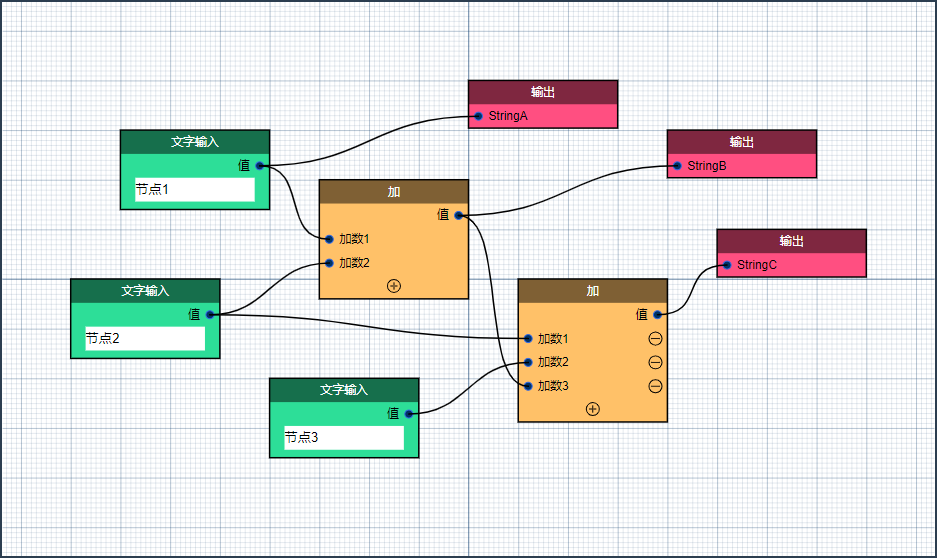

# 基于 Vue.js 3.x 的可视化节点编辑器组件



## 安装

```$xslt
# 执行以下命令在当前项目中安装vue-node-editor3
npm install vue-node-editor3 --save
```

## 构建

### 环境依赖

1. NodeJs v16.15.1 (npm 8.11.0)
2. Vue 3.2.37

### 构建步骤

```$xslt
# 安装依赖包
npm install --legacy-peer-deps

# 运行示例
npm run serve

# 构建版本
npm run build

# 清理构建文件
npm run build:clean
```

**注意！**

由于ESlint存在大量的依赖冲突问题，安装依赖包时请加入`--legacy-peer-deps`参数以忽略依赖冲突

## 版权说明

项目地址：

- GitHub [https://github.com/cambridgejames/vue-node-editor3](https://github.com/cambridgejames/vue-node-editor3)
- Gitee [https://gitee.com/powerinv/vue-node-editor3](https://gitee.com/powerinv/vue-node-editor3)

该项目签署了MIT授权许可，详情请参阅 [LICENSE](LICENSE) 文件
