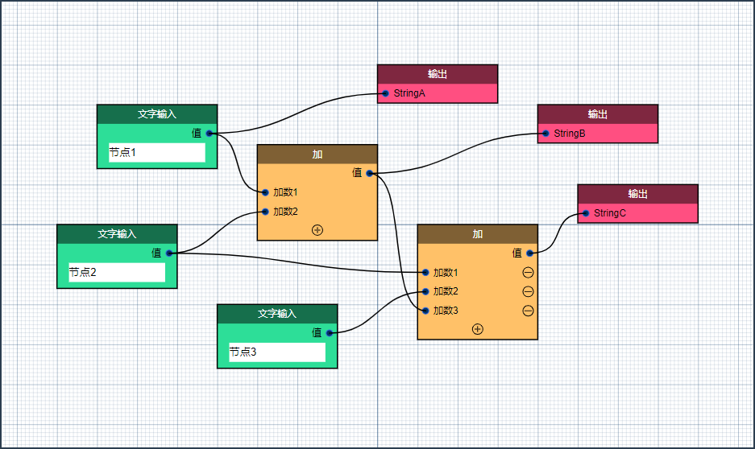

# NodeEditor3-vue

---

## 简介

NodeEditor3-vue 是一个基于 Vue.js 3.x 的前端可视化节点编辑器组件。

若要着手进行本组件的开发，请先参考[组件开发构建指南](./docs/guide/build.md)。

若要快速上手并使用本组件，请参考[快速开始](./docs/guide/quick-start.md)。

若要为项目提交Issue，请转至右侧Github链接：[https://github.com/cambridgejames/NodeEditor3-vue/issues](https://github.com/cambridgejames/NodeEditor3-vue/issues)

## 版权说明

项目地址：

- GitHub [https://github.com/cambridgejames/NodeEditor3-vue](https://github.com/cambridgejames/NodeEditor3-vue)
- Gitee [https://gitee.com/powerinv/node-editor3-vue](https://gitee.com/powerinv/node-editor3-vue)

该项目签署了MIT授权许可，详情请参阅 [LICENSE](LICENSE) 文件

开发者邮箱：cambridge_james@foxmail.com

